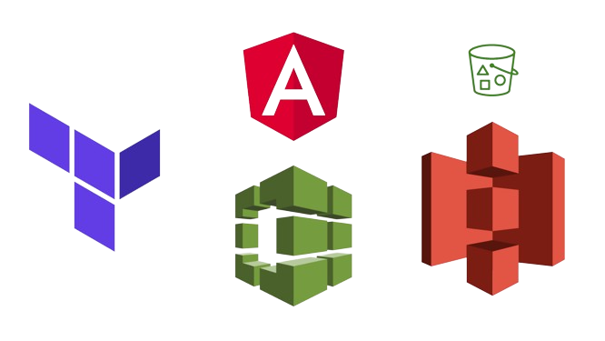

# Terraform Aws Codebuild to S3 Static - Angular

    

This Terraform Project creates an AWS Codebuild for building and uploading output to S3 Bucket,
The Bucket is configured to Static Host the OutPut angular Website.
The Codebuild usage docker Node.js image to build angular project, while running it i found that
sometimes docker hub rate limits codebuild, that is why I am using Aws Secrets Manager to Store
a Docker PAT

### Resources Created

1. AWS Codebuild Project
2. S3 Bucket (Public Static Web Hosting Enabled)

### Links -

* [Angular Emi Calculator Project - Github](https://github.com/satyam7world/emi-calculator-angular.git)